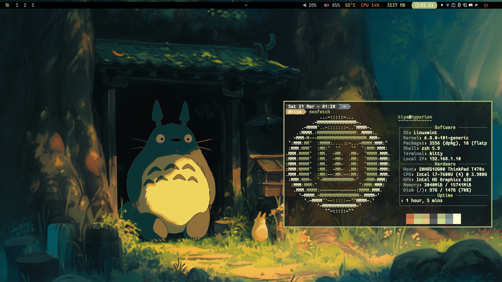

# mintea-i3 🍵

## 📸 Preview


## 🖥️ Setup
| Component | Software |
|-----------|----------|
| WM | i3 |
| Bar | Polybar |
| Terminal | Kitty |
| Shell | Zsh + oh-my-zsh |
| Launcher | Rofi |
| Compositor | Picom |
| Notif | Dunst |
| File Manager | Thunar |
| System Monitor | Btop |

## 🎨 Color Scheme
| Color | Hex |
|-------|-----|
| Background | `#141414` |
| Foreground | `#feffd3` |
| Red/Orange | `#c06c43` |
| Green/Olive | `#afb979` |
| Yellow | `#c2a86c` |
| Cyan/Grey | `#778284` |

## ⌨️ Keybinds
| Key | Action |
|-----|--------|
| `$mod + enter` | Terminal |
| `$mod + d` | Rofi launcher |
| `$mod + e` | File manager |
| `$mod + q` | Kill window |
| `Print` | Screenshot |

## 📦 Dependencies
```bash
sudo apt install i3 polybar kitty rofi picom dunst thunar btop playerctl brightnessctl feh
```

## 🙏 Credits
- Rofi themes by [JaKooLit](https://github.com/JaKooLit)
- Inspired by various dotfiles from the community
